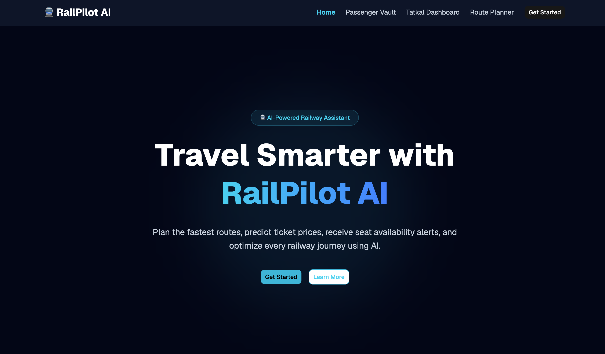
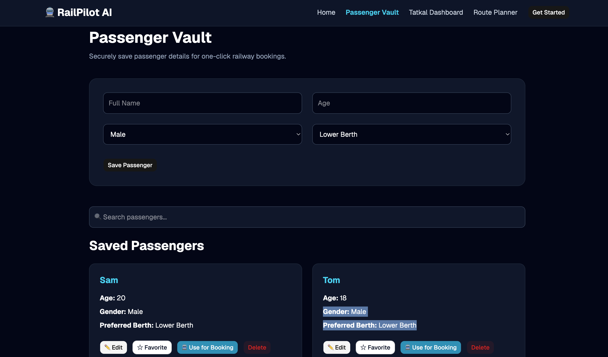
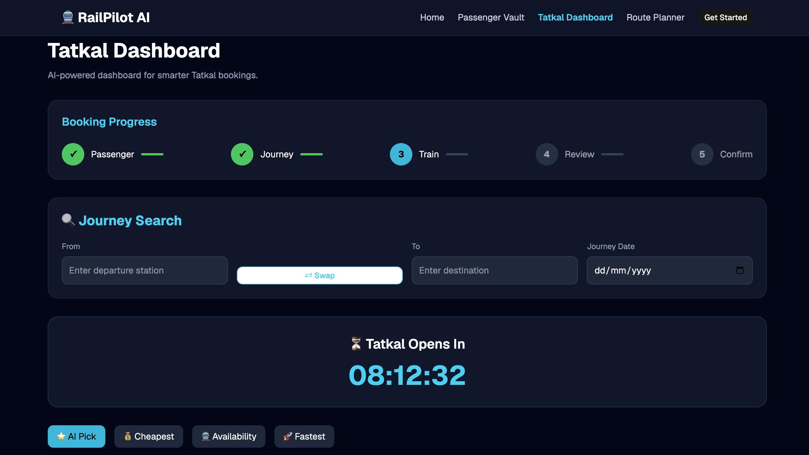
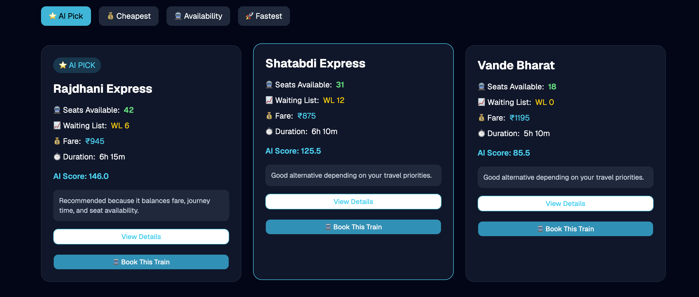
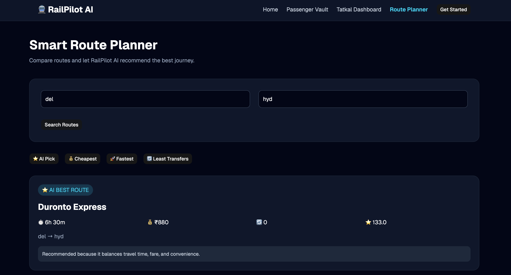

# 🚆 RailPilot AI

<div align="center">

### AI-Powered Railway Booking Assistant

Plan smarter. Book faster. Travel better.

Built with **React**, **TypeScript**, **Tailwind CSS**, and **React Router**.

</div>

---

## 📖 Overview

RailPilot AI is an AI-powered railway booking assistant designed to simplify the Tatkal booking experience. It provides intelligent train recommendations, secure passenger management, route planning, and an intuitive booking workflow with a modern, responsive interface.

The project demonstrates modern frontend development practices using reusable React components, TypeScript, Context API, and responsive UI design.

---

## ✨ Features

### 🏠 Landing Page
- Modern responsive UI
- AI-powered railway assistant branding
- Smooth navigation

### 👤 Passenger Vault
- Save passenger details
- Edit passenger information
- Delete passengers
- Mark favourite passengers
- Search passengers
- One-click booking selection
- Local Storage persistence

### 🚆 Tatkal Dashboard
- Live Tatkal countdown timer
- AI-based train ranking
- Journey search
- Station autocomplete
- Swap source and destination
- Train sorting
  - ⭐ AI Pick
  - 💰 Cheapest
  - 🚆 Availability
  - 🚀 Fastest
- Train Details Modal
- Interactive booking workflow

### 🗺 Route Planner
- Compare railway routes
- AI recommended route
- Sort by
  - AI Pick
  - Cheapest
  - Fastest
  - Least Transfers

### 📋 Booking Workflow
- Booking Progress Tracker
- Passenger Review
- Booking Confirmation

### 🎨 UI/UX
- Responsive Design
- Dark Theme
- Modern Cards
- Interactive Buttons
- Loading States
- Reusable Components

---

# 🛠 Tech Stack

| Technology | Usage |
|------------|-------|
| React | Frontend Framework |
| TypeScript | Type Safety |
| Tailwind CSS | Styling |
| React Router | Routing |
| Context API | State Management |
| Local Storage | Data Persistence |
| Vite | Build Tool |

---

# 📂 Project Structure

```
src/
│
├── components/
│   ├── Navbar
│   ├── Hero
│   ├── BookingProgress
│   ├── TrainDetailsModal
│   ├── StationAutocomplete
│   └── Footer
│
├── pages/
│   ├── Home
│   ├── PassengerVault
│   ├── TatkalDashboard
│   ├── RoutePlanner
│   ├── BookingReview
│   └── BookingConfirmation
│
├── context/
│   └── BookingContext
│
├── data/
│   ├── trains.ts
│   └── routes.ts
│
└── App.tsx
```

---

## 📸 Screenshots

### 🏠 Home



---

### 👤 Passenger Vault



---

### 🚆 Tatkal Dashboard



---

### 🚄 Train Recommendations



---

### 🗺️ Route Planner



# 🚀 Getting Started

## Clone the Repository

```bash
git clone https://github.com/your-username/railpilot-ai.git
```

## Navigate into the project

```bash
cd railpilot-ai
```

## Install dependencies

```bash
npm install
```

## Start development server

```bash
npm run dev
```

Open

```
http://localhost:5173
```

---

# 📈 Future Improvements

- Live IRCTC API Integration
- AI-based Fare Prediction
- Seat Availability Prediction
- PNR Status Tracking
- Live Train Status
- Voice Assistant
- Push Notifications
- User Authentication
- Cloud Database Integration
- Payment Gateway Integration
- Multi-language Support

---

# 💡 Learning Outcomes

This project helped in learning:

- React Component Architecture
- TypeScript
- React Hooks
- Context API
- State Management
- Responsive UI Design
- Tailwind CSS
- React Router
- Local Storage
- Reusable Components

---

# 🤝 Contributing

Contributions are welcome.

1. Fork the repository
2. Create a new branch

```bash
git checkout -b feature-name
```

3. Commit changes

```bash
git commit -m "Add feature"
```

4. Push changes

```bash
git push origin feature-name
```

5. Open a Pull Request

---

# 📄 License

This project is licensed under the MIT License.

---

# 👨‍💻 Author

**Shashwat Singh Patel**

- GitHub: https://github.com/shashhwt31

---

<div align="center">

### ⭐ If you like this project, consider giving it a star!

Made with ❤️ using React + TypeScript

</div>